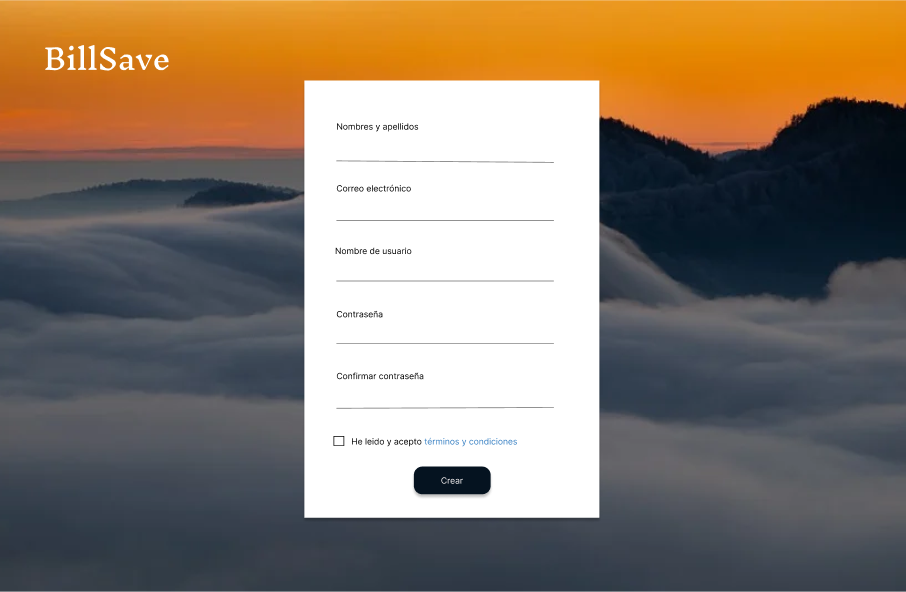
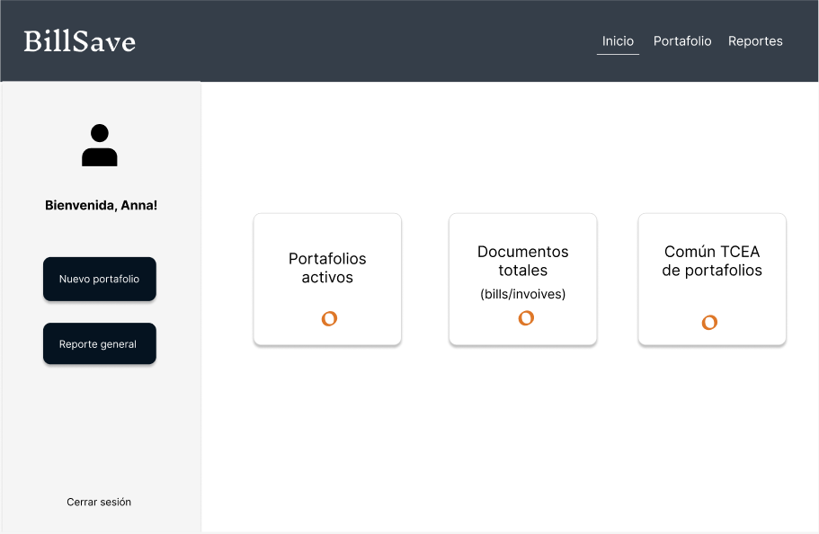
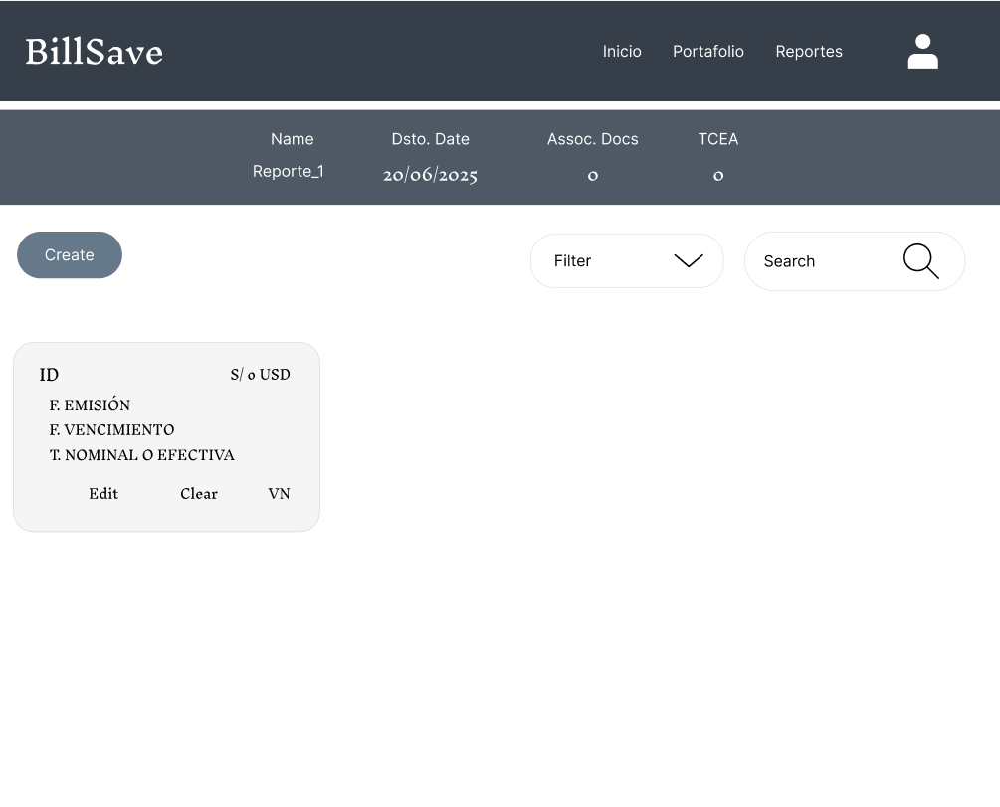
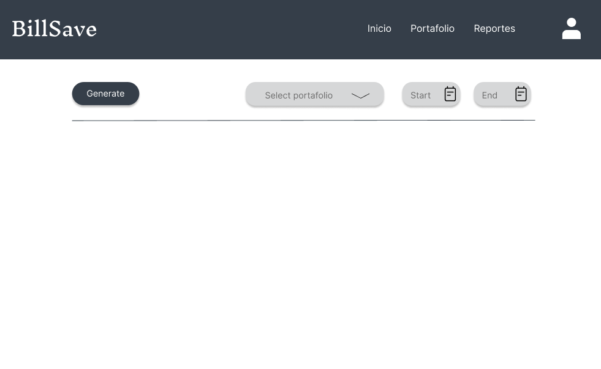
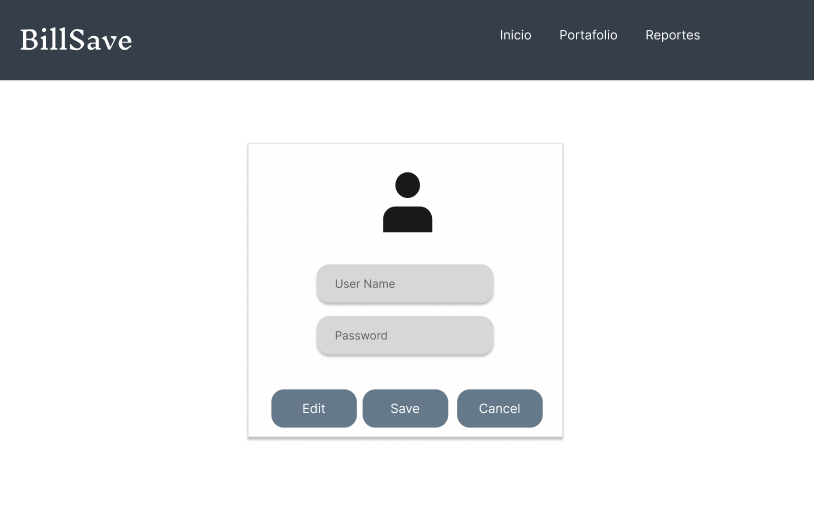

# BillSave

<div style="text-align: center;">
  <h1>Documentación de BillSave</h1>
  
</div>

<div style="display: flex; justify-content: center;">
  <div>
    <h4 style="text-align: center; margin-bottom: 1.2rem;">Startup: FinWorkTech</h4>
    <table border="1" style="margin: auto;">
      <thead>
        <tr>
          <td style="text-align: center;"><strong>Miembros:</strong></td>
        </tr>
      </thead>
      <tbody>
        <tr>
          <td>Gonzalo Andre Quedena</td>
        </tr>
        <tr>
          <td>Dary Jarod Guevara Rojas</td>
        </tr>
        <tr>
          <td>Mirian Emilia Miranda Ccora</td>
        </tr>
        <tr>
          <td>Daniel Jesús Muñoz Fano</td>
        </tr>
        <tr>
          <td>Romina Alejandra Tuesta Marin</td>
        </tr>
      </tbody>
    </table>
    <h5 style="text-align: center; margin-top: 2rem;">2025</h5>
  </div>
</div>

---

## Índice

- [Introducción](#introducción)  
- [Objetivo del Estudiante (Student Outcome)](#objetivo-del-estudiante-student-outcome)  
- [Definiciones generales y conceptos básicos](#definiciones-generales-y-conceptos-básicos)  
- [Marco Legal y Teórico](#marco-legal-y-teórico)  
- [Análisis y Diseño del Sistema](#análisis-y-diseño-del-sistema)  
  - [Análisis de Datos](#análisis-de-datos)  
  - [Diseño de la Interface](#diseño-de-la-interface)  
  - [Marco conceptual (fórmulas)](#marco-conceptual-fórmulas)  
  - [Diseño de Datos de prueba](#diseño-de-datos-de-prueba)  
- [Algoritmo](#algoritmo)  
- [Modelo de la Base de datos](#modelo-de-la-base-de-datos)  
- [Sistema de información](#sistema-de-información)  
- [Anexos](#anexos)  
- [Bibliografía](#bibliografía)

---

## Introducción
Descripción general del proyecto y los objetivos principales de la solución.

## Objetivo del Estudiante (Student Outcome)
Descripción de los logros que el estudiante espera alcanzar a través del desarrollo del proyecto.

## Definiciones generales y conceptos básicos

A continuación, se presentan las definiciones de los principales términos y conceptos utilizados en el desarrollo del proyecto, los cuales son esenciales para comprender el contexto financiero y económico en el que se basa.

1. Cartera
Según Santander (2023): “nos referimos a la suma de activos financieros que posee una persona física o jurídica, como acciones, bonos, fondos de inversión, materias primas”. En términos generales, una cartera representa el conjunto de inversiones de un individuo o entidad, cuyo objetivo puede ser la rentabilidad, la diversificación del riesgo o la protección del capital. La composición de una cartera varía según el perfil del inversionista y las condiciones del mercado.
 
2. TCEA (Tasa de Costo Efectivo Anual)
El TCEA es un indicador financiero que permite conocer el costo total de un crédito o préstamo en términos anuales. Se compone de la tasa de interés nominal, las comisiones y otros gastos adicionales asociados al financiamiento. En otras palabras, refleja el verdadero costo que el cliente debe asumir al solicitar un préstamo. Se incluyen dentro de esta tasa los cargos cobrados por cuenta de terceros, como seguros o gastos administrativos, lo que la convierte en una métrica clave para comparar diferentes opciones de financiamiento.
  
3. Acciones
Las acciones representan partes proporcionales del capital de una empresa. Al adquirir una acción, el inversionista se convierte en propietario de una fracción de la compañía y puede beneficiarse de los dividendos o del incremento en el valor de las acciones con el tiempo. Las acciones pueden ser ordinarias o preferentes, dependiendo de los derechos y beneficios que otorgan al accionista. Su precio fluctúa constantemente en el mercado bursátil debido a factores como el desempeño financiero de la empresa y las condiciones económicas globales.

4. Valor de la tasa
Según la Superintendencia de Banca, Seguros y AFP del Perú, el dinero tiene un costo que puede manifestarse de manera pasiva o activa. La tasa pasiva se refiere a la remuneración que un banco paga a sus clientes por los depósitos realizados en cuentas de ahorro, cuentas a plazo u otros instrumentos financieros. En contraste, la tasa activa es aquella que el banco cobra a sus clientes por los préstamos otorgados, reflejando el costo del crédito para el usuario. Estas tasas están influenciadas por factores como la política monetaria, la inflación y el riesgo asociado a cada operación financiera.

5. Tasa nominal y tasa efectiva
Continuando con la denominación de las tasas, según la Superintendencia de Banca, Seguros y AFP del Perú, la Tasa de Costo Efectivo Anual (TCEA) es un indicador financiero que incluye todas las comisiones y costos asociados a un crédito, representando así el gasto real que el cliente debe asumir. Por otro lado, la Tasa de Interés Efectiva Anual (TEA) es la tasa que expresa el costo del dinero en un periodo anual sin incluir costos adicionales. Mientras que la tasa nominal es aquella que no toma en cuenta el efecto de la capitalización de intereses, la tasa efectiva sí lo considera, reflejando con mayor precisión el costo o rendimiento real de una operación financiera.

6. Número nominal
Un número nominal es un número que se utiliza únicamente como un identificador o etiqueta, sin que tenga un valor cuantitativo o un orden específico. Es decir, no indica cantidad ni posición, sino que solo sirve para diferenciar o clasificar elementos dentro de un sistema. Por ejemplo: DNI o número de pasaporte, Se usa para identificar a una persona, pero no indica una cantidad ni una jerarquía.

# Marco Legal y Teórico

En el Perú, el marco normativo que regula las acciones y el mercado de valores se basa en varias leyes y regulaciones clave diseñadas para garantizar la transparencia y el correcto funcionamiento de las actividades financieras. teniendo a la Superintendencia de Banca, Seguros y AFP del Perú como fuente principal, podemos destacar las principales normativas aplicables:

Artículo 29º. 		. INSCRIPCIÓN DE ACCIONES DE LA EMPRESA EN LA BOLSA. Antes de que las empresas bancarias, financieras y de arrendamiento financiero, así como las empresas del sistema de seguros, inicien sus operaciones con el público, deberán tener inscritas en bolsa las acciones representativas de su capital social. La Superintendencia podrá exigir a aquellas empresas no comprendidas en el párrafo anterior, su inscripción en bolsa, cuando así lo considere pertinente.

Artículo 51º.		. TENENCIA DE ACCIONES POR UNA SOLA PERSONA. 
Para la tenencia de acciones en una determinada empresa de los sistemas financiero o de seguros por una sola persona, no existe más limitación que la que impone el requisito establecido en el artículo anterior. 

Ley General de Sociedades (Ley N° 26887):

Esta ley establece las disposiciones generales sobre la constitución, organización, funcionamiento y disolución de las sociedades en el Perú. Regula aspectos relacionados con las acciones, como su emisión, transmisión y derechos de los accionistas. Por ejemplo, en una sociedad anónima, el capital está representado por acciones nominativas, y los accionistas no responden personalmente por las deudas sociales

Cálculo de la Tasa de Costo Efectivo Anual (TCEA):

La TCEA es una medida que refleja el costo total de un crédito, incluyendo no solo la tasa de interés nominal, sino también comisiones, seguros y otros gastos asociados. Para calcularla, se utiliza la siguiente fórmula:

La TCEA refleja el costo total de un crédito, incluye la tasa de interés nominal, comisiones, seguros y otros gastos asociados:

TCEA=((1+it)^k−1)×100TCEA=((1+it)k−1)×100

Donde:

    ia: Tasa de costo efectiva anual
    it: Tasa de costo efectiva correspondiente al periodo de pago de la cuota (Tasa Interna de Retorno - TIR)
    k: Número de periodos de pago en un año

## Análisis y Diseño del Sistema


### Análisis de Datos
## 5. Análisis y Diseño del Sistema

### 5.1. Análisis de Datos

El análisis de datos desempeña un papel fundamental en cualquier proyecto, ya que proporciona una visión profunda y significativa que impulsa la toma de decisiones informadas y la eficacia operativa.

### 5.1.1. Datos de Entrada

#### **Login Page (Pantalla de inicio de sesión)**
| Nombre | Descripción | Tipo de Datos | Formato |
|--------|------------|--------------|---------|
| Usuario | Correo electrónico o nombre de usuario. | Texto | Cadena de caracteres |
| Contraseña | Clave de acceso del usuario. | Texto (password) | Cadena de caracteres |

#### **Register Page (Página de Registro)**
| Nombre | Descripción | Tipo de Datos | Formato |
|--------|------------|--------------|---------|
| Nombre completo | Nombre y apellido del usuario. | Texto | Cadena de caracteres |
| Correo electrónico | Dirección de correo del usuario. | Texto | Correo electrónico válido |
| Nombre de usuario | Identificador único del usuario. | Texto | Cadena de caracteres |
| Contraseña | Clave de acceso del usuario. | Texto (password) | Cadena de caracteres |
| Confirmación de contraseña | Validación de la contraseña ingresada. | Texto (password) | Cadena de caracteres |
| Aceptar términos y condiciones | Confirmación de aceptación de términos. | Booleano | Verdadero/Falso |

#### **Portfolio Form Page (Formulario de cartera)**
| Nombre | Descripción | Tipo de Datos | Formato |
|--------|------------|--------------|---------|
| Nombre del portafolio | Identificación del portafolio financiero. | Texto | Cadena de caracteres |
| Fecha de descuento | Fecha en la que se aplica el descuento del portafolio. | Fecha | DD/MM/AAAA |

#### **Document Form Page (Formulario de documento)**
| Nombre | Descripción | Tipo de Datos | Formato |
|--------|------------|--------------|---------|
| Código del documento | Código único del documento financiero. | Texto | Cadena de caracteres |
| Valor nominal | Valor nominal del documento. | Número decimal | Numérico |
| Fecha de emisión | Fecha de emisión del documento. | Fecha | DD/MM/AAAA |
| Fecha de vencimiento | Fecha límite del documento financiero. | Fecha | DD/MM/AAAA |
| Tasa nominal o efectiva | Tasa de interés aplicada al documento. | Número decimal | Numérico |
| Moneda | Tipo de moneda utilizada (S/ o USD). | Texto | Cadena de caracteres |

---

### 5.1.2. Datos Intermedios (Cálculos y Procesamientos)
| Nombre | Descripción | Tipo de Datos | Formato |
|--------|------------|--------------|---------|
| TCEA promedio del portafolio | Cálculo del Tasa de Costo Efectivo Anual promedio de los documentos. | Número decimal | Numérico |
| Estado del documento financiero | Cálculo del estado actual del documento (Activo, Vencido, Pagado). | Texto | Cadena de caracteres |

---

### 5.1.3. Datos de Salida
#### **Estado de cuenta actual:**
| Nombre | Descripción | Tipo de Datos | Formato |
|--------|------------|--------------|---------|
| Número total de portafolios activos | Cantidad de portafolios en estado activo. | Número entero | Número entero |
| Número total de documentos en el sistema | Cantidad de documentos registrados en el sistema. | Número entero | Número entero |
| Reporte financiero generado | Informe con datos financieros de portafolios y documentos. | Documento generado | Documento |


### Diseño de la Interface
- Presentación de las pantallas de interacción con el sistema.  
- Uso de medios electrónicos para recibir ayuda sobre el uso del sistema.

En un sistema, el diseño de la interfaz de usuario (UI) juega un papel fundamental en la experiencia y eficiencia de los usuarios. Un diseño bien estructurado no solo facilita la navegación y el acceso a la información clave, sino que también garantiza seguridad, accesibilidad y usabilidad en cada interacción.

El área de diseño de interfaz se enfoca en crear soluciones visuales intuitivas que optimicen la interacción con el sistema, asegurando que las transacciones financieras, consultas de datos y gestiones operativas se realicen de manera clara y sin fricciones. Para ello, se aplican principios de diseño centrado en el usuario (UX/UI), alineados con normativas de accesibilidad y estándares de la industria financiera.

<h4 style="text-align: center; margin-bottom: 1.2rem;">Figura 1</h4>

Nota: Pantalla inicial para el usuario.

<h4 style="text-align: center; margin-bottom: 1.2rem;">Figura 2</h4>

Nota: Pantalla de aplicativo para registro de nuevos usuarios.


<h4 style="text-align: center; margin-bottom: 1.2rem;">Figura 3</h4>
<table border="1" style="margin: auto;">

Nota: Pantalla de inicio del usuario registrado.

<h4 style="text-align: center; margin-bottom: 1.2rem;">Figura 4</h4>

Nota: Pantalla que muestra los portafolios registrados por el usuario.

<h4 style="text-align: center; margin-bottom: 1.2rem;">Figura 5</h4>

Nota: Pantalla en donde el usuario registra nuevos portafolios.

<h4 style="text-align: center; margin-bottom: 1.2rem;">Figura 6</h4>

Nota: Pantalla en donde el usuario puede buscar el portafolio por medio del nombre y fecha de emisión.


<h4 style="text-align: center; margin-bottom: 1.2rem;">Figura 7</h4>

Nota: Pantalla por la cual se puede ver los reportes de los portafolios y/o creal uno nuevo.


<h4 style="text-align: center; margin-bottom: 1.2rem;">Figura 8</h4>

Nota: Pantalla del portafolio.


<h4 style="text-align: center; margin-bottom: 1.2rem;">Figura 9</h4>

Nota: Pantalla en donde el usuario puede visualizar/modificar su perfil.


### Marco conceptual (fórmulas)
- Presentación del modelo matemático y las fórmulas utilizadas en la aplicación, como el cálculo del Valor Recibido y la TCEA.

### Diseño de Datos de prueba
- Mínimo 2 juegos de datos de prueba para comprobar la veracidad del modelo.

## Algoritmo
- Pseudocódigo, Diagrama de Flujo o Diagrama de Nassi-Schneiderman que ilustre la solución.

## Modelo de la Base de datos
- Presentación del modelo entidad-relación de la base de datos que se utilizará en la implementación.

## Sistema de información
- Implementación del análisis y diseño del sistema utilizando un lenguaje de programación orientado al desarrollo web o móvil.  
- Requisitos:  
  a) Conectividad.  
  b) Base de datos.  
  c) Código fuente.  
  d) Ayuda y asistencia técnica.  
  e) Validación y pruebas.

# BillSave - Documentación del Sistema de Información

## 8. Sistemas de Información

### **8.1. Conectividad**
La aplicación **BillSave** sigue una arquitectura cliente-servidor basada en API RESTful, facilitando la comunicación entre el frontend y el backend.

#### **8.1.1. Comunicación entre Frontend y Backend**
- **Frontend:** Desarrollado en **Vue.js**, usa **Axios** para realizar solicitudes HTTP a la API del backend.
- **Backend:** Construido con **.NET Core y C#**, expone una API RESTful que maneja autenticación, gestión de carteras y facturas.
- **Configuración de la API:**
  ```env
  VITE_API_BASE_URL=https://api.example.com
  VITE_SUNAT_API_TOKEN=your-sunat-token-here
  ```

#### **8.1.2. Integraciones Externas**
- **API de SUNAT**: Validación de facturas mediante consultas externas.
- **Exportación de informes**: Generación de reportes en **Excel** desde el backend.

#### **8.1.3. Infraestructura y Hosting**
- **Servidor Backend:** Puede ejecutarse en **Azure**, **AWS** o servidores con soporte para .NET Core.
- **Base de Datos:** Implementada en **MySQL**, administrada con **Entity Framework Core**.
- **Seguridad:** Implementación de **JWT** para autenticación de usuarios.

---

### **8.2. Base de Datos: Desarrollo de Backend**
El backend de **BillSave** sigue los principios de **Domain-Driven Design (DDD)** y está estructurado en contextos delimitados como **Carteras**, **Facturas** y **Usuarios**.

#### **8.2.1. Tecnologías Utilizadas**
- **Lenguaje:** C# con .NET Core
- **Base de Datos:** MySQL, gestionada con **Entity Framework Core**
- **Autenticación:** JSON Web Tokens (**JWT**)
- **Documentación API:** **Swagger** para facilitar la interacción con los endpoints

#### **8.2.2. Entidades Principales**
La base de datos está estructurada en las siguientes entidades:
- **Usuarios:** Gestión de credenciales y roles.
- **Carteras:** Portafolios financieros de facturas.
- **Facturas:** Documentos financieros asociados a carteras.
- **Reportes:** Generación y almacenamiento de informes.

#### **8.2.3. Estructura del Backend**
El backend sigue una arquitectura en capas:
1. **Capa de Presentación (API)** - Controladores de ASP.NET Core.
2. **Capa de Aplicación** - Servicios y reglas de negocio.
3. **Capa de Datos** - Repositorios con Entity Framework Core.

---

### **8.3. Código Fuente**

#### **8.3.1. Estructura del Código**
##### **Frontend (Vue.js)**
```
BillSave-app/
│── src/
│   ├── components/        # Componentes Vue
│   ├── views/             # Vistas principales
│   ├── router/            # Configuración de Vue Router
│   ├── store/             # Gestión de estado con Pinia
│   ├── api/               # Integración con Axios
│── public/
│── package.json           # Dependencias del proyecto
│── vite.config.js         # Configuración de Vite
```
##### **Backend (.NET Core con C#)**
```
BillSave-backend/
│── BillSave.API/
│   ├── Controllers/        # Endpoints RESTful
│   ├── Services/           # Lógica de negocio
│   ├── Models/             # Entidades de la base de datos
│   ├── Repositories/       # Acceso a la base de datos
│   ├── Program.cs          # Punto de inicio de la API
│   ├── Startup.cs          # Configuración de dependencias
│── appsettings.json        # Configuración de la API
│── BillSave-backend.sln    # Archivo de solución para Visual Studio
```

#### **8.3.2. Ejecución del Código**
##### **Frontend (Vue.js)**
1. Clonar el repositorio:
   ```bash
   git clone https://github.com/FinWorkTech/BillSave-app.git
   cd BillSave-app
   ```
2. Instalar dependencias:
   ```bash
   npm install
   ```
3. Configurar las variables de entorno en un archivo `.env`:
   ```env
   VITE_API_BASE_URL=https://api.example.com
   VITE_SUNAT_API_TOKEN=your-sunat-token-here
   ```
4. Iniciar la aplicación:
   ```bash
   npm run dev
   ```

##### **Backend (.NET Core con C#)**
1. Clonar el repositorio:
   ```bash
   git clone https://github.com/FinWorkTech/BillSave-backend.git
   cd BillSave-backend
   ```
2. Compilar el código:
   ```bash
   dotnet build
   ```
3. Ejecutar el backend:
   ```bash
   dotnet run
   ```
4. Acceder a la API en:
   ```
   http://localhost:5000/swagger
   ```

---

### **Conclusión**
El sistema de información de **BillSave** está diseñado con **Vue.js para el frontend, .NET Core con C# para el backend y MySQL como base de datos**. La comunicación se realiza mediante **API RESTful** con autenticación segura mediante **JWT**, integrándose con la **API de SUNAT** para validar documentos financieros y permitiendo la exportación de informes en **Excel**. 

Este diseño facilita la gestión de carteras financieras y automatiza el cálculo de la **TCEA**, optimizando la administración de documentos financieros.


## Anexos
- Presentación de alto impacto académico/comercial de la aplicación, encartes, brochures informativos u otros materiales relacionados con la aplicación.

## Bibliografía

# 9. Referencias

1. Oracle. (2023). *Java Platform, Standard Edition Documentation*. Oracle Corporation. Recuperado de https://docs.oracle.com/javase/8/docs/

2. PostgreSQL Global Development Group. (2023). *PostgreSQL 15 Documentation*. Recuperado de https://www.postgresql.org/docs/15/index.html

3. Pivotal Software. (2023). *Spring Boot Reference Guide*. Recuperado de https://docs.spring.io/spring-boot/docs/current/reference/html/

4. GitHub, Inc. (2023). *GitHub Documentation*. Recuperado de https://docs.github.com/en

5. OWASP Foundation. (2023). *OWASP ZAP - The Zed Attack Proxy*. Recuperado de https://www.zaproxy.org/

6. Apache Software Foundation. (2023). *Apache JMeter User Manual*. Recuperado de https://jmeter.apache.org/usermanual/index.html
           
7. Superintendencia de Banca, Seguros y AFP. (s.f.). Recuperado de https://www.sbs.gob.pe/Portals/3/educacion-financiera-pdf/4_Productos%20y%20servicios%202018.pdf
           
8. Santander. (2023). https://www.santanderassetmanagement.es/que-es-una-cartera-de-valores/

