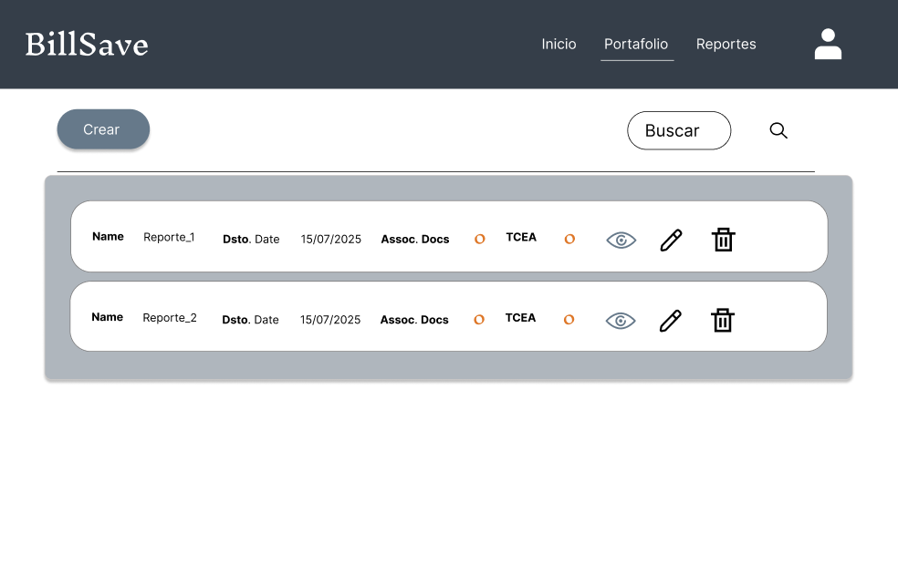
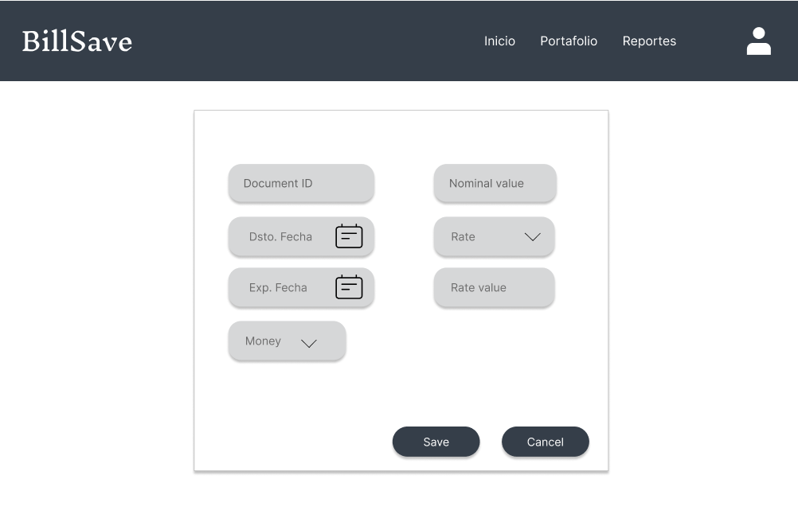
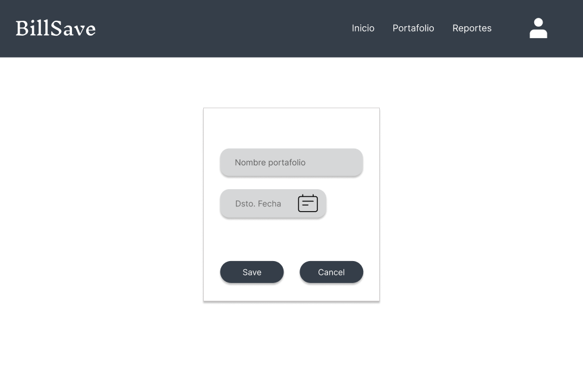
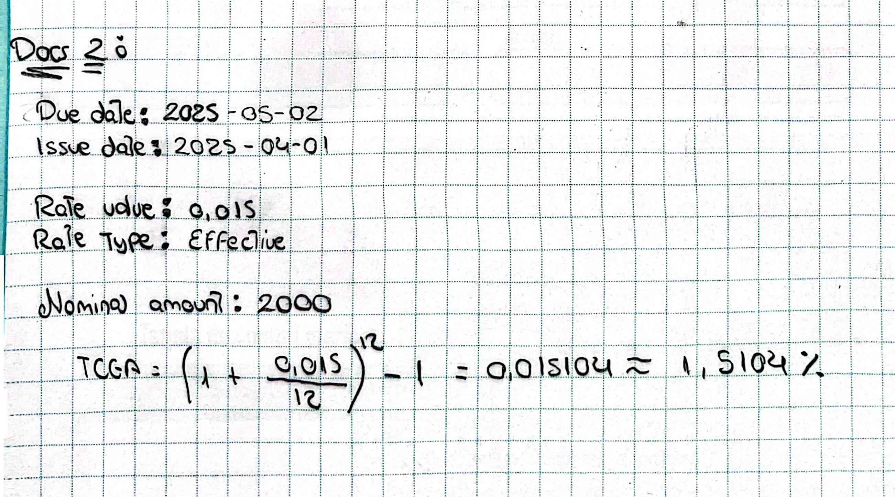
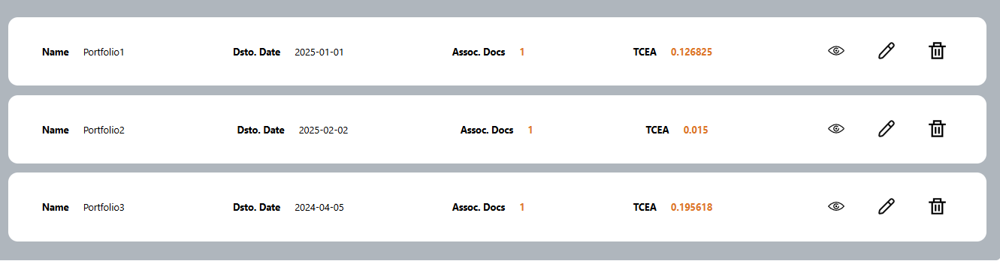
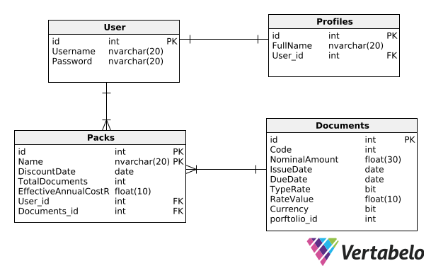

# BillSave

<div style="text-align: center;">
  <h1>Documentación</h1>
  
</div>

<div style="display: flex; justify-content: center;">
  <div>
    <h4 style="text-align: center; margin-bottom: 1.2rem;">Startup: FinWorkTech</h4>
    <table border="1" style="margin: auto;">
      <thead>
        <tr>
          <td style="text-align: center;"><strong>Miembros:</strong></td>
        </tr>
      </thead>
      <tbody>
        <tr>
          <td>Gonzalo Andre Quedena</td>
        </tr>
        <tr>
          <td>Dary Jarod Guevara Rojas</td>
        </tr>
        <tr>
          <td>Mirian Emilia Miranda Ccora</td>
        </tr>
        <tr>
          <td>Daniel Jesús Muñoz Fano</td>
        </tr>
        <tr>
          <td>Romina Alejandra Tuesta Marin</td>
        </tr>
      </tbody>
    </table>
    <h5 style="text-align: center; margin-top: 2rem;">2025</h5>
  </div>
</div>

---

## Índice

- [Introducción](#introducción)  
- [Objetivo del Estudiante (Student Outcome)](#objetivo-del-estudiante-student-outcome)  
- [Definiciones generales y conceptos básicos](#definiciones-generales-y-conceptos-básicos)  
- [Marco Legal y Teórico](#marco-legal-y-teórico)  
- [Análisis y Diseño del Sistema](#análisis-y-diseño-del-sistema)  
  - [Análisis de Datos](#análisis-de-datos)  
  - [Diseño de la Interface](#diseño-de-la-interface)  
  - [Marco conceptual (fórmulas)](#marco-conceptual-fórmulas)  
  - [Diseño de Datos de prueba](#diseño-de-datos-de-prueba)  
- [Algoritmo](#algoritmo)  
- [Modelo de la Base de datos](#modelo-de-la-base-de-datos)  
- [Sistema de información](#sistema-de-información)  
- [Anexos](#anexos)  
- [Bibliografía](#bibliografía)

---

## Introducción
<p align="justify">
Para muchas empresas pequeñas y medianas (PYME), este puede ser un gran desafío para mantener un flujo de caja saludable. A menudo tienen dinero que no es para la recolección de cartas o facturas, pero inmediatamente necesitan dinero para continuar operando, pagando a los proveedores o invirtiendo en su crecimiento. En estos casos, una solución generalizada es reducir estas cartas o facturas, es decir, venderlas a la unidad financiera a cambio de recibir dinero antes de la fecha de vencimiento.
Sin embargo, este proceso no siempre es tan simple como parece. Las empresas deben calcular las tasas de descuento correctamente, saber cuánto les costará realmente esta operación y comprender cómo afecta su rentabilidad. Nuestra aplicación se usa aquí. El objetivo de este proyecto es desarrollar una aplicación web/móvil que ayude a las PYME a administrar su cartera de letras y facturas de una manera simple y eficiente. Con esta herramienta, pueden revelar y administrar sus documentos comerciales, establecer fechas de descuento y calcular automáticamente el porcentaje del costo efectivo anual (TCEA), todo rápidamente y sin complicaciones. Además, la aplicación opera en las plantas y en dólares y le permite elegir entre precios nominales o efectivos que se adapten a las necesidades de cada usuario.
La seguridad también es la clave, por lo que el acceso estará protegido por el usuario y la contraseña. Además, los mensajes detallados que muestran la cartera y su TCEA relevante pueden en cualquier momento, lo que permite a las empresas tomar mejores decisiones financieras.
En resumen, el propósito de esta aplicación es simplificar el proceso económico, que, si bien puede parecer técnico, es importante para la estabilidad y el crecimiento de muchas PYME. Al ofrecer una herramienta intuitiva y eficiente, queremos ayudar a más empresas a acceder a la liquidez sin complicaciones y con información clara sobre el costo y los beneficios de cada operación.
</p>

## Objetivo del Estudiante (Student Outcome)
El desarrollo del proyecto permitió alcanzar los siguientes resultados de aprendizaje:

**- ABET – EAC - Student Outcome 1:** Se identificaron y solucionaron problemas complejos de ingeniería financiera a través de una aplicación web que automatiza el cálculo de la TCEA, facilitando así la toma de decisiones económicas en pequeñas y medianas empresas

**- ABET – CAC - Student Outcome 1:** Se utilizaron principios de computación y matemáticas para diseñar y desarrollar algoritmos que gestionaran las tasas de interés nominales y efectivas, asegurando que los cálculos financieros fueran precisos.

**- ICACIT - Student Outcome A:** Se aplicaron habilidades matemáticas y de ingeniería en el desarrollo de modelos financieros que facilita evaluar diferentes alternativas de inversión y optimizar la gestión de cartera de descuento de letras y facturas.

**- ICACIT - Student Outcome E:** Se estudiaron problemas complejos de ingeniería financiera mediante la investigación y el uso de metodologías específicas para evaluar de manera precisa el costo de los instrumentos financieros, siempre con un enfoque basado en principios matemáticos.

**- ICACIT - Student Outcome L:** Se demostró experiencia en la gestión de ingeniería financiera y en la toma de decisiones económicas a traves del desarrollo de una aplicación que facilita el análisis de rentabilidad y costos de descuento, mejorando la eficiencia operativa de las empresas.


## Definiciones generales y conceptos básicos

A continuación, se presentan las definiciones de los principales términos y conceptos utilizados en el desarrollo del proyecto, los cuales son esenciales para comprender el contexto financiero y económico en el que se basa.

###### 1. Cartera
Según Santander (2023): “nos referimos a la suma de activos financieros que posee una persona física o jurídica, como acciones, bonos, fondos de inversión, materias primas”. En términos generales, una cartera representa el conjunto de inversiones de un individuo o entidad, cuyo objetivo puede ser la rentabilidad, la diversificación del riesgo o la protección del capital. La composición de una cartera varía según el perfil del inversionista y las condiciones del mercado.
 
###### 2. TCEA (Tasa de Costo Efectivo Anual)
El TCEA es un indicador financiero que permite conocer el costo total de un crédito o préstamo en términos anuales. Se compone de la tasa de interés nominal, las comisiones y otros gastos adicionales asociados al financiamiento. En otras palabras, refleja el verdadero costo que el cliente debe asumir al solicitar un préstamo. Se incluyen dentro de esta tasa los cargos cobrados por cuenta de terceros, como seguros o gastos administrativos, lo que la convierte en una métrica clave para comparar diferentes opciones de financiamiento.
  
###### 3. Acciones
Las acciones representan partes proporcionales del capital de una empresa. Al adquirir una acción, el inversionista se convierte en propietario de una fracción de la compañía y puede beneficiarse de los dividendos o del incremento en el valor de las acciones con el tiempo. Las acciones pueden ser ordinarias o preferentes, dependiendo de los derechos y beneficios que otorgan al accionista. Su precio fluctúa constantemente en el mercado bursátil debido a factores como el desempeño financiero de la empresa y las condiciones económicas globales.

###### 4. Valor de la tasa
Según la Superintendencia de Banca, Seguros y AFP del Perú, el dinero tiene un costo que puede manifestarse de manera pasiva o activa. La tasa pasiva se refiere a la remuneración que un banco paga a sus clientes por los depósitos realizados en cuentas de ahorro, cuentas a plazo u otros instrumentos financieros. En contraste, la tasa activa es aquella que el banco cobra a sus clientes por los préstamos otorgados, reflejando el costo del crédito para el usuario. Estas tasas están influenciadas por factores como la política monetaria, la inflación y el riesgo asociado a cada operación financiera.

###### 5. Tasa nominal y tasa efectiva
Continuando con la denominación de las tasas, según la Superintendencia de Banca, Seguros y AFP del Perú, la Tasa de Costo Efectivo Anual (TCEA) es un indicador financiero que incluye todas las comisiones y costos asociados a un crédito, representando así el gasto real que el cliente debe asumir. Por otro lado, la Tasa de Interés Efectiva Anual (TEA) es la tasa que expresa el costo del dinero en un periodo anual sin incluir costos adicionales. Mientras que la tasa nominal es aquella que no toma en cuenta el efecto de la capitalización de intereses, la tasa efectiva sí lo considera, reflejando con mayor precisión el costo o rendimiento real de una operación financiera.

###### 6. Número nominal
Un número nominal es un número que se utiliza únicamente como un identificador o etiqueta, sin que tenga un valor cuantitativo o un orden específico. Es decir, no indica cantidad ni posición, sino que solo sirve para diferenciar o clasificar elementos dentro de un sistema. Por ejemplo: DNI o número de pasaporte, Se usa para identificar a una persona, pero no indica una cantidad ni una jerarquía.

## Marco Legal y Teórico

En el Perú, el marco normativo que regula las acciones y el mercado de valores se basa en varias leyes y regulaciones clave diseñadas para garantizar la transparencia y el correcto funcionamiento de las actividades financieras. teniendo a la Superintendencia de Banca, Seguros y AFP del Perú como fuente principal, podemos destacar las principales normativas aplicables:

**Artículo 29º. 		. INSCRIPCIÓN DE ACCIONES DE LA EMPRESA EN LA BOLSA**  
Antes de que las empresas bancarias, financieras y de arrendamiento financiero, así como las empresas del sistema de seguros, inicien sus operaciones con el público, deberán tener inscritas en bolsa las acciones representativas de su capital social. La Superintendencia podrá exigir a aquellas empresas no comprendidas en el párrafo anterior, su inscripción en bolsa, cuando así lo considere pertinente.

**Artículo 51º.		. TENENCIA DE ACCIONES POR UNA SOLA PERSONA**  
Para la tenencia de acciones en una determinada empresa de los sistemas financiero o de seguros por una sola persona, no existe más limitación que la que impone el requisito establecido en el artículo anterior. 

#### Ley General de Sociedades (Ley N° 26887):

<p align="justify">
Esta ley establece las disposiciones generales sobre la constitución, organización, funcionamiento y disolución de las sociedades en el Perú. Regula aspectos relacionados con las acciones, como su emisión, transmisión y derechos de los accionistas. Por ejemplo, en una sociedad anónima, el capital está representado por acciones nominativas, y los accionistas no responden personalmente por las deudas sociales
</p>

###### Cálculo de la Tasa de Costo Efectivo Anual (TCEA):

La **TCEA** es una medida que refleja el costo total de un crédito, incluyendo no solo la tasa de interés nominal, sino también comisiones, seguros y otros gastos asociados. Para calcularla, se utiliza la siguiente fórmula:

La **TCEA** refleja el costo total de un crédito, incluye la tasa de interés nominal, comisiones, seguros y otros gastos asociados:

$$\text{TCEA} = \left( (1 + i_t)^k - 1 \right) \times 100$$

Donde:

    ia: Tasa de costo efectiva anual
    it: Tasa de costo efectiva correspondiente al periodo de pago de la cuota (Tasa Interna de Retorno - TIR)
    k: Número de periodos de pago en un año

## Análisis y Diseño del Sistema

### Análisis de Datos
#### 5. Análisis y Diseño del Sistema

##### 5.1. Análisis de Datos

<p align="justify">
El análisis de datos desempeña un papel fundamental en cualquier proyecto, ya que proporciona una visión profunda y significativa que impulsa la toma de decisiones informadas y la eficacia operativa.
</p>

###### 5.1.1. Datos de Entrada

**Login Page (Pantalla de inicio de sesión)**
| Nombre | Descripción | Tipo de Datos | Formato |
|--------|------------|--------------|---------|
| Usuario | Correo electrónico o nombre de usuario. | Texto | Cadena de caracteres |
| Contraseña | Clave de acceso del usuario. | Texto (password) | Cadena de caracteres |

**Register Page (Página de Registro)**
| Nombre | Descripción | Tipo de Datos | Formato |
|--------|------------|--------------|---------|
| Nombre completo | Nombre y apellido del usuario. | Texto | Cadena de caracteres |
| Correo electrónico | Dirección de correo del usuario. | Texto | Correo electrónico válido |
| Nombre de usuario | Identificador único del usuario. | Texto | Cadena de caracteres |
| Contraseña | Clave de acceso del usuario. | Texto (password) | Cadena de caracteres |
| Confirmación de contraseña | Validación de la contraseña ingresada. | Texto (password) | Cadena de caracteres |
| Aceptar términos y condiciones | Confirmación de aceptación de términos. | Booleano | Verdadero/Falso |

**Portfolio Form Page (Formulario de cartera)**
| Nombre | Descripción | Tipo de Datos | Formato |
|--------|------------|--------------|---------|
| Nombre del portafolio | Identificación del portafolio financiero. | Texto | Cadena de caracteres |
| Fecha de descuento | Fecha en la que se aplica el descuento del portafolio. | Fecha | DD/MM/AAAA |

**Document Form Page (Formulario de documento)**
| Nombre | Descripción | Tipo de Datos | Formato |
|--------|------------|--------------|---------|
| Código del documento | Código único del documento financiero. | Texto | Cadena de caracteres |
| Valor nominal | Valor nominal del documento. | Número decimal | Numérico |
| Fecha de emisión | Fecha de emisión del documento. | Fecha | DD/MM/AAAA |
| Fecha de vencimiento | Fecha límite del documento financiero. | Fecha | DD/MM/AAAA |
| Tasa nominal o efectiva | Tasa de interés aplicada al documento. | Número decimal | Numérico |
| Moneda | Tipo de moneda utilizada (S/ o USD). | Texto | Cadena de caracteres |


###### 5.1.2. Datos Intermedios (Cálculos y Procesamientos)
| Nombre | Descripción | Tipo de Datos | Formato |
|--------|------------|--------------|---------|
| TCEA promedio del portafolio | Cálculo del Tasa de Costo Efectivo Anual promedio de los documentos. | Número decimal | Numérico |
| Estado del documento financiero | Cálculo del estado actual del documento (Activo, Vencido, Pagado). | Texto | Cadena de caracteres |


###### 5.1.3. Datos de Salida
**Estado de cuenta actual:**
| Nombre | Descripción | Tipo de Datos | Formato |
|--------|------------|--------------|---------|
| Número total de portafolios activos | Cantidad de portafolios en estado activo. | Número entero | Número entero |
| Número total de documentos en el sistema | Cantidad de documentos registrados en el sistema. | Número entero | Número entero |
| Reporte financiero generado | Informe con datos financieros de portafolios y documentos. | Documento generado | Documento |

## Diseño de la Interface
- Presentación de las pantallas de interacción con el sistema.  
- Uso de medios electrónicos para recibir ayuda sobre el uso del sistema.

En un sistema, el diseño de la interfaz de usuario (UI) juega un papel fundamental en la experiencia y eficiencia de los usuarios. Un diseño bien estructurado no solo facilita la navegación y el acceso a la información clave, sino que también garantiza seguridad, accesibilidad y usabilidad en cada interacción.

El área de diseño de interfaz se enfoca en crear soluciones visuales intuitivas que optimicen la interacción con el sistema, asegurando que las transacciones financieras, consultas de datos y gestiones operativas se realicen de manera clara y sin fricciones. Para ello, se aplican principios de diseño centrado en el usuario (UX/UI), alineados con normativas de accesibilidad y estándares de la industria financiera.

### Figura 1
   

**Nota:** Pantalla inicial para el usuario.

---

### Figura 2


**Nota:** Pantalla de aplicativo para registro de nuevos usuarios.

---

### Figura 3
  

**Nota:** Pantalla de inicio del usuario registrado.

---

### Figura 4


**Nota:**  Pantalla que muestra los portafolios registrados por el usuario.

---

### Figura 5
  

**Nota:**  Pantalla en donde el usuario registra nuevos portafolios.

---

### Figura 6


**Nota:**  Pantalla en donde el usuario puede buscar el portafolio por medio del nombre y fecha de emisión.

---


### Figura 7


**Nota:**  Pantalla por la cual se puede ver los reportes de los portafolios y/o creal uno nuevo.

---

### Figura 8


**Nota:**  Pantalla del portafolio.

---

### Figura 9


**Nota:**  Pantalla en donde el usuario puede visualizar/modificar su perfil.


## Marco conceptual (fórmulas)
<p align="justify">
En este apartado, se presentan las fórmulas matemáticas utilizadas en el desarrollo de la aplicación, enfocadas en el cálculo de la Tasa de Coste Efectivo Anual (TCEA) tanto a nivel individual (para cada letra o factura) como a nivel global (para toda la cartera de documentos).
</p>

<p align="justify">
El proceso inicia con la determinación de la TCEA individual de cada letra o factura descontada, considerando el valor recibido tras aplicar los descuentos e impuestos correspondientes. Posteriormente, se calcula la TCEA de la cartera, obteniendo un valor ponderado en función del monto nominal de cada documento.
</p>

Las fórmulas clave utilizadas en estos cálculos son las siguientes:

**1. Tasa de Coste Efectivo Anual (TCEA):**
<p align="justify">
La TCEA es un indicador financiero que refleja el costo total del descuento de una cartera de letras o facturas, expresado en términos anuales. Se calcula con la siguiente fórmula:
</p>
     
<div width="100%" style="display:flex; justify-content: center; margin: 15px 0 15px 0;">
  
</div>
     
* TCEA = Tasa de Coste Efectivo Anual
* VE = Valor entregado por la entidad financiera al vencimiento de la factura o letra
* VR = Valor recibido por la empresa
* n = Número de días hasta el vencimiento de la factura o letra


**2. TCEA de la Cartera:**
<p align="justify">
Una vez obtenida la TCEA individual de cada letra o factura, es necesario calcular la TCEA de la cartera, que representa el costo efectivo anualizado de toda la cartera de documentos descontados. Este cálculo se realiza ponderando la TCEA de cada documento según su monto nominal, permitiendo obtener una tasa representativa del conjunto de facturas y letras descontadas. Se calcula con la siguiente fórmula:
</p>

<div width="100%" style="display:flex; justify-content: center; margin: 15px 0 15px 0;">
  
</div>

* n = Número total de letras o facturas en la cartera

## Diseño de Datos de prueba
<p align="justify">
Para validar la correcta implementación del modelo desarrollado en la administración de cartera de descuento de facturas,  se han diseñado dos conjuntos de datos de prueba. Estos datos permiten comprobar la veracidad del cálculo de la Tasa de Coste Efectivo Anual (TCEA).
</p>

<ins>**Primer Juego de Datos de Prueba**<ins>

Este escenario simula una factura en dólares con una tasa nominal.

- Due date: 2025-04-01
- Issue date: 2025-03-01
- Rate value: 0.12
- Rate type: Nominal
- Nominal amount: 1000


**Cálculos esperado:**

***TCEA:*** 0.126825 = 12.68%

<ins>**Segundo Juego de Datos de Prueba**<ins>

Este escenario simula una factura en dólares con una tasa efectiva.

- Due date: 2026-05-02
- Issue date: 2026-04-01
- Rate value: 0.015
- Rate type: Effective
- Nominal amount: 2000



**Cálculo esperado:**

***TCEA:*** 0.015 = 1.5%

<ins>**Tercer Juego de Datos de Prueba**<ins>

Este escenario simula una factura en dólares con una tasa nominal.
- Due date: 2026-03-03
- Issue date: 2025-02-01
- Rate value: 0.18
- Rate type: Nominal
- Nominal amount: 15000


**Cálculo esperado:**

***TCEA:*** 0.195618 = 19.56%

#### Resultado esperado en el sistema
Aquí podemos observar el cálculo realizado para cada portafolio respecto a los **n** documentos que cada uno almacena ***(1 por cada 1 en este caso)*** del promedio TCEA obtenido del TCEA de cada documento.



## Algoritmo
<p align="justify">
El diagrama de flujo representa el proceso de cálculo de la Tasa de Coste Efectivo Anual (TCEA) en la aplicación. Comienza con la recepción del evento DocumentChangedEvent, lo que desencadena la obtención de los documentos asociados a una cartera. Luego, se procede a calcular la TCEA, evaluando cada documento individualmente mediante la validación de fechas, el cálculo de la tasa efectiva y el valor presente. Una vez obtenida la TCEA de toda la cartera, esta información se actualiza en el servicio externo. Finalmente, el proceso concluye, asegurando que la cartera refleje la tasa correcta.
</p>


## Modelo de la Base de datos
<p align="justify">
Este modelo permite gestionar usuarios con perfiles, administrar documentos financieros y agruparlos en paquetes de descuento para calcular la TCEA y manejar tasas nominales o efectivas en diferentes monedas.
</p>

<div width="100%" style="display:flex; justify-content: center; margin: 15px 0 15px 0;">
  
</div>

**1. User**
  - id (PK): Identificador único del usuario.
  - Username: Nombre de usuario para autenticación.
  - Password: Contraseña del usuario.

    Relaciones:
    - Se relaciona con Profiles mediante User_id (1 usuario tiene 1 perfil).
    - Se relaciona con Packs, indicando que un usuario puede administrar varios paquetes.
      
**2. Profiles**
  - id (PK): Identificador único del perfil.
  - FullName: Nombre completo del usuario.
  - User_id (FK): Relación con la tabla User, lo que indica que cada usuario tiene un único perfil.

    Relaciones:
    - User (1 a 1). Un usuario tiene un perfil asociado.

**3. Documents**
  - id (PK): Identificador único del documento.
  - Code: Código del documento.
  - NominalAmount: Monto nominal de la factura o letra.
  - IssueDate: Fecha de emisión del documento.
  - DueDate: Fecha de vencimiento del documento.
  - TypeRate: Tipo de tasa (bit: 0 = Nominal, 1 = Efectiva).
  - RateValue: Valor de la tasa de interés.
  - Currency: Tipo de moneda (bit: 0 = Soles, 1 = Dólares).
  - portfolio_id: Relacionado con portafolios.

    Relaciones:
    - Se relaciona con Packs, indicando que un paquete de descuento puede agrupar varios documentos.
  
**4. Packs**
  - id (PK): Identificador único del paquete.
  - Name: Nombre del paquete.
  - DiscountDate: Fecha en la que se aplica el descuento.
  - TotalDocuments: Número total de documentos en el paquete.
  - EffectiveAnnualCostR: Tasa de Costo Efectivo Anual (TCEA).
  - User_id (FK): Relación con User, indicando quién creó el paquete.
  - Documents_id (FK): Relación con Documents, indicando qué documentos están en el paquete.
  
    Relaciones:
    - Relacionado con User, indicando que cada usuario puede administrar varios paquetes de descuento.
    - Relacionado con Documents, ya que un paquete de descuento puede contener varios documentos financieros.

# BillSave - Documentación del Sistema de Información

## 8. Sistemas de Información

### **8.1. Conectividad**
La aplicación **BillSave** sigue una arquitectura cliente-servidor basada en API RESTful, facilitando la comunicación entre el frontend y el backend.

#### **8.1.1. Comunicación entre Frontend y Backend**
- **Frontend:** Desarrollado en **Vue.js**, usa **Axios** para realizar solicitudes HTTP a la API del backend.
- **Backend:** Construido con **.NET Core y C#**, expone una API RESTful que maneja autenticación, gestión de carteras y facturas.
- **Configuración de la API:**
  ```env
  VITE_API_BASE_URL=https://api.example.com
  VITE_SUNAT_API_TOKEN=your-sunat-token-here
  ```

#### **8.1.2. Integraciones Externas**
- **API de SUNAT**: Validación de facturas mediante consultas externas.
- **Exportación de informes**: Generación de reportes en **Excel** desde el backend.

#### **8.1.3. Infraestructura y Hosting**
- **Servidor Backend:** Desplegado en **Azure**, **AWS** o servidores locales con soporte para .NET Core.
- **Base de Datos:** Implementada en **MySQL**, gestionada con **Entity Framework Core**.
- **Seguridad:** Implementación de **JWT** para autenticación de usuarios.

---

### **8.2. Base de Datos: Desarrollo de Backend**
El backend de **BillSave** sigue los principios de **Domain-Driven Design (DDD)** y está estructurado en contextos delimitados como **Carteras**, **Facturas** y **Usuarios**.

#### **8.2.1. Tecnologías Utilizadas**
- **Lenguaje:** C# con .NET Core
- **Base de Datos:** MySQL, gestionada con **Entity Framework Core**
- **Autenticación:** JSON Web Tokens (**JWT**)
- **Documentación API:** **Swagger** para facilitar la interacción con los endpoints

#### **8.2.2. Entidades Principales**
La base de datos está estructurada en las siguientes entidades:
- **Usuarios:** Gestión de credenciales y roles.
- **Carteras:** Portafolios financieros de facturas.
- **Facturas:** Documentos financieros asociados a carteras.
- **Reportes:** Generación y almacenamiento de informes.

#### **8.2.3. Estructura del Backend**
El backend sigue una arquitectura en capas:
1. **Capa de Presentación (API)** - Controladores de ASP.NET Core.
2. **Capa de Aplicación** - Servicios y reglas de negocio.
3. **Capa de Datos** - Repositorios con Entity Framework Core.

---

### **8.3. Código Fuente**

#### **8.3.1. Estructura del Código**
##### **Frontend (Vue.js)**
```
BillSave-app/
│── src/
│   ├── components/        # Componentes Vue
│   ├── views/             # Vistas principales
│   ├── router/            # Configuración de Vue Router
│   ├── store/             # Gestión de estado con Pinia
│   ├── api/               # Integración con Axios
│   ├── assets/            # Archivos estáticos
│   ├── main.js            # Punto de entrada de la aplicación
│   ├── App.vue            # Componente principal
│── public/
│── package.json           # Dependencias del proyecto
│── vite.config.js         # Configuración de Vite
```
##### **Backend (.NET Core con C#)**
```
BillSave-backend/
│── BillSave.API/
│   ├── Controllers/        # Endpoints RESTful
│   ├── Services/           # Lógica de negocio
│   ├── Models/             # Entidades de la base de datos
│   ├── Repositories/       # Acceso a la base de datos
│   ├── Program.cs          # Punto de inicio de la API
│   ├── Startup.cs          # Configuración de dependencias
│── appsettings.json        # Configuración de la API
│── BillSave-backend.sln    # Archivo de solución para Visual Studio
```

#### **8.3.2. Ejecución del Código**
##### **Frontend (Vue.js)**
1. Clonar el repositorio:
   ```bash
   git clone https://github.com/FinWorkTech/BillSave-app.git
   cd BillSave-app
   ```
2. Instalar dependencias:
   ```bash
   npm install
   ```
3. Configurar las variables de entorno en un archivo `.env`:
   ```env
   VITE_API_BASE_URL=https://api.example.com
   VITE_SUNAT_API_TOKEN=your-sunat-token-here
   ```
4. Iniciar la aplicación:
   ```bash
   npm run dev
   ```

##### **Backend (.NET Core con C#)**
1. Clonar el repositorio:
   ```bash
   git clone https://github.com/FinWorkTech/BillSave-backend.git
   cd BillSave-backend
   ```
2. Abrir en **Visual Studio** y compilar el código:
   ```bash
   dotnet build
   ```
3. Ejecutar el backend:
   ```bash
   dotnet run
   ```
4. Acceder a la API en:
   ```
   http://localhost:5000/swagger
   ```

---

### **Conclusión**
El sistema de información de **BillSave** está diseñado con **Vue.js para el frontend, .NET Core con C# para el backend y MySQL como base de datos**. La comunicación se realiza mediante **API RESTful** con autenticación segura mediante **JWT**, integrándose con la **API de SUNAT** para validar documentos financieros y permitiendo la exportación de informes en **Excel**. 

Este diseño facilita la gestión de carteras financieras y automatiza el cálculo de la **TCEA**, optimizando la administración de documentos financieros.


## Anexos
- Presentación de alto impacto académico/comercial de la aplicación, encartes, brochures informativos u otros materiales relacionados con la aplicación.

## Bibliografía

- Apache Software Foundation. (2023). *Apache JMeter user manual*. Recuperado de [https://jmeter.apache.org/usermanual/index.html](https://jmeter.apache.org/usermanual/index.html)  

- GitHub, Inc. (2023). *GitHub documentation*. Recuperado de [https://docs.github.com/en](https://docs.github.com/en)  

- Markdown. (s.f.). *Basic syntax*. Recuperado el 2 de marzo de 2025, de [https://www.markdownguide.org/basic-syntax/](https://www.markdownguide.org/basic-syntax/)  

- Oracle. (2023). *Java Platform, Standard Edition documentation*. Oracle Corporation. Recuperado de [https://docs.oracle.com/javase/8/docs/](https://docs.oracle.com/javase/8/docs/)  

- OWASP Foundation. (2023). *OWASP ZAP - The Zed Attack Proxy*. Recuperado de [https://www.zaproxy.org/](https://www.zaproxy.org/)  

- Pivotal Software. (2023). *Spring Boot reference guide*. Recuperado de [https://docs.spring.io/spring-boot/docs/current/reference/html/](https://docs.spring.io/spring-boot/docs/current/reference/html/)  

- PostgreSQL Global Development Group. (2023). *PostgreSQL 15 documentation*. Recuperado de [https://www.postgresql.org/docs/15/index.html](https://www.postgresql.org/docs/15/index.html)  

- Santander. (2023). *¿Qué es una cartera de valores?* Recuperado de [https://www.santanderassetmanagement.es/que-es-una-cartera-de-valores/](https://www.santanderassetmanagement.es/que-es-una-cartera-de-valores/)  

- Superintendencia de Banca, Seguros y AFP. (s.f.). *Productos y servicios financieros*. Recuperado de [https://www.sbs.gob.pe/Portals/3/educacion-financiera-pdf/4_Productos%20y%20servicios%202018.pdf](https://www.sbs.gob.pe/Portals/3/educacion-financiera-pdf/4_Productos%20y%20servicios%202018.pdf)  

